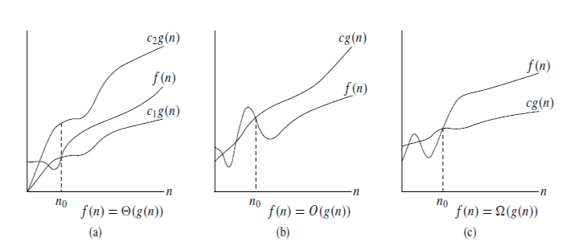
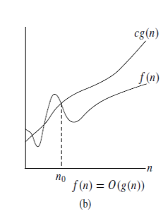
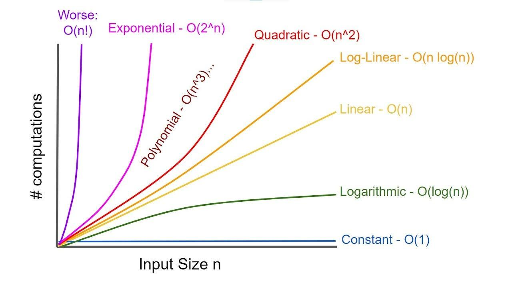

# Big O & Complexity Analysis

**Category:** Basics &nbsp;|&nbsp; **Difficulty:** <span style="color: #334155; font-weight: 600;">Basic</span> &nbsp;|&nbsp; **Importance:** <span style="color: #ef4444; font-weight: 600;">High</span>

---

This guidebook details how we measure algorithm efficiency, evaluate time and space complexity, and use Big-O notation.

## Measuring Algorithm Efficiency

Rather than measuring execution time in seconds (which varies depending on hardware), we count the number of basic operations the algorithm performs relative to the input size \(n\).

### Example Code Analysis

```python
a = 1 + 1           # 2 operations (constant time)
for i in range(n):  # n operations
    for j in range(n):  # n^2 operations
        print(i, j)
```

The total number of operations is represented by the Complexity Equation:

$$T(n) = n^2 + n + 2$$

As \(n\) grows extremely large, only the dominant term matters. The constants and smaller terms become negligible noise. This is the foundation of **Asymptotic Analysis** — we drop the smaller terms (\(n\) and \(2\)) to focus on the dominant rate of growth: \(n^2\).

## Asymptotic Analysis & Bounds

In asymptotic analysis, we evaluate the growth rate of algorithms under different scenarios:

- **Worst Case (Upper Bound)**: The maximum number of operations the algorithm could perform.
- **Average Case (Tight Bound)**: The expected behavior on typical inputs.
- **Best Case (Lower Bound)**: The minimum operations required under ideal inputs.



## Big-O Notation

Big-O notation is the mathematical language we use to express the upper bound of an algorithm’s growth rate:

- **Mathematical Definition**: We write \(T(n) = O(f(n))\) to indicate that, for large \(n\), your algorithm’s operations grow no faster than \(f(n)\).
- **In Plain English**: It is an upper bound on how your algorithm scales — a worst-case guarantee that your algorithm will never perform worse than this.



### Example

For the function:

$$T(n) = 3n^2 + 100n + 500$$

This simplifies to \(T(n) = O(n^2)\). We ignore the coefficient \(3\), the linear term \(100n\), and the constant \(500\). We only focus on the dominant shape of growth, which is quadratic (\(n^2\)).

## The Complexity Ladder

The higher you go up the ladder, the faster the algorithm’s performance degrades as the input size \(n\) increases.



| Complexity | Type | Max \(n\) safe in ~1s |
|---|---|---|
| \(O(1)\) | Constant | Any |
| \(O(\log n)\) | Logarithmic | Any |
| \(O(\sqrt{n})\) | Square Root | ~\(10^{16}\) |
| \(O(n)\) | Linear | ~\(10^{8}\) |
| \(O(n \log n)\) | Linearithmic | ~\(10^{7}\) |
| \(O(n^2)\) | Quadratic | ~\(10^{4}\) |
| \(O(n^3)\) | Cubic | ~\(10^{2}\) |
| \(O(2^n)\) | Exponential | ~\(20\) |
| \(O(n!)\) | Factorial | ~\(12\) |

## Complexity Analysis Examples

Below are five practical examples demonstrating how to evaluate the Big-O complexity of different code structures.

### Example 1 — Linear Search

```python
for i in range(1, n+1):
    if A[i] == t: return True
```

**Complexity**: \(O(n)\) — Linear time.

### Example 2 — Two Sequential Loops

```python
for i in range(1, n+1):
    if A[i] == t: return True
for i in range(1, n+1):
    if B[i] == t: return True
```

The loops run one after the other. Total steps are \(n + n = 2n\). Since we drop constant factors:

$$2n \rightarrow O(n)$$

### Example 3 — Nested Loops

```python
for i in range(1, n+1):
    for j in range(1, n+1):
        if A[i] == B[j]: return True
```

**Complexity**: \(O(n^2)\) — Quadratic time.

### Example 4 — Dependent Boundaries

```python
for i in range(1, n+1):
    for j in range(i+1, n+1):
        if A[i] == A[j]: return True
```

Even though the inner loop runs fewer iterations on average, the quadratic growth shape is preserved:

$$\frac{n(n-1)}{2} = \frac{1}{2}n^2 - \frac{1}{2}n \rightarrow O(n^2)$$

### Example 5 — Constant Inner Loop

```python
for i in range(1, n+1):
    for j in range(1, 11):
        print(A[i][j])
```

The inner loop runs exactly \(10\) times regardless of \(n\). Since \(10\) is a constant:

$$10 \times n = 10n \rightarrow O(n)$$

---

## Additional Resources
No other additional resources were added to this topic.

---

## Practice Problems
| ID | Problem | Platform | Difficulty |
|---|---|---|---|
| atcoder_abc051_b | [Sum of Three Integers](https://atcoder.jp/contests/abc051/tasks/abc051_b) | AtCoder | <span style="color: #d97706; font-weight: 600;">Medium</span> |
| codeforces_1328a | [Divisibility Problem](https://codeforces.com/problemset/problem/1328/A) | Codeforces | <span style="color: #2563eb; font-weight: 600;">Easy</span> |
| codeforces_486a | [Calculating Function](https://codeforces.com/problemset/problem/486/A) | Codeforces | <span style="color: #2563eb; font-weight: 600;">Easy</span> |
| codeforces_598a | [Tricky Sum](https://codeforces.com/problemset/problem/598/A) | Codeforces | <span style="color: #2563eb; font-weight: 600;">Easy</span> |
| codeforces_630a | [Again Twenty Five!](https://codeforces.com/problemset/problem/630/A) | Codeforces | <span style="color: #2563eb; font-weight: 600;">Easy</span> |
| cses_1069 | [Repetitions](https://cses.fi/problemset/task/1069) | CSES | <span style="color: #d97706; font-weight: 600;">Medium</span> |


---

[Return to Home](../../../index.md)
