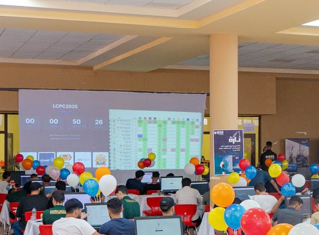
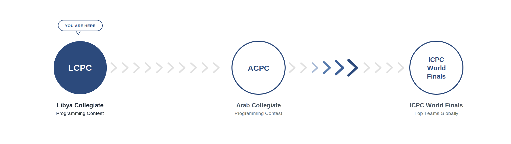
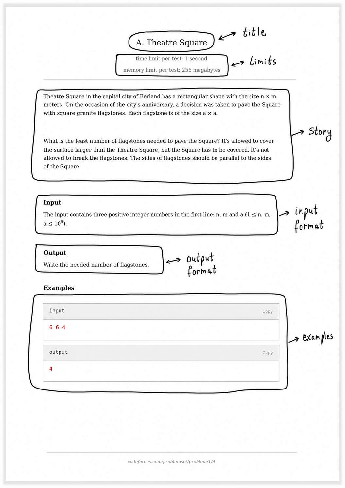

# Intro to CP & Complexity

**Category:** Basics  
**Difficulty:** ● Very Easy

---

This topic covers the fundamentals of Competitive Programming, the metrics we use to judge algorithm efficiency, and how to analyze code complexity.

## What is Competitive Programming?

Competitive programming is a mind sport that combines two distinct but equally important skills:

1. **Designing algorithms**: Requiring problem-solving abilities and mathematical thinking.
2. **Implementing them**: Writing the code correctly and efficiently under tight time pressure.

In competitive programming, you are given a problem statement accompanied by strict execution time and memory limits. Your goal is to write a program that solves the problem correctly and within these bounds.

Once submitted, your solution is judged automatically by an online system. It is either accepted or it is not — there is no partial credit, and no "almost correct" solutions.

## Why Competitive Programming?

Engaging in competitive programming offers several key benefits:

- **Tech Career Preparation**: Technical interviews at top technology companies test exactly these problem-solving and implementation skills.
- **Mathematical Growth**: It builds mathematical maturity and refines your ability to reason under constraints.
- **Problem-Solving Mindset**: You are not just learning a list of algorithms; you are building a structured way of thinking.

As Antti Laaksonen states in the *Competitive Programmer's Handbook*:
> “It takes a long time to become a good competitive programmer, but it is also an opportunity to learn a lot.”

## The Competition Ladder

The competitive programming landscape is structured like a ladder, scaling from local challenges to international arenas.

## The Online Judge

In competitive programming, you submit your code through a web interface. The online judge compiles your code and runs it against a set of hidden test cases. You never get to see these test cases; you must think of edge cases and verify your solution’s correctness on your own before submitting.

Every submission returns exactly one of the following verdicts:

| Verdict | Meaning |
|---|---|
| Accepted | Correct output, within time limit |
| Wrong Answer | Incorrect output on at least one case |
| Time Limit Exceeded | Correct logic, too slow |
| Runtime Error | Crash — division by zero, out of bounds, etc. |
| Compilation Error | Code didn’t compile |

## Your First Problem

To understand how to read problem constraints and construct solutions, we begin by analyzing a starter problem.

## Algorithms & Data Structures

Every solution in competitive programming is composed of an algorithm working in tandem with one or more data structures. If you modify one, the entire performance of your solution changes. An algorithm is only as fast as the data structures it runs on.

- **Algorithm**: A step-by-step method to solve a problem. It must be both correct and efficient. Think of it as *the recipe* — it defines what actions to perform and in what order.
- **Data Structure**: A concrete way to organize and store data so that operations can be performed efficiently. It is *the container*, and its shape determines which operations are cheap and which are expensive.

---

## YouKn0wWho Academy Reference
While we prepare our written explanations for this topic, you can follow the interactive path and submit solutions directly on the YouKn0wWho Academy platform:

👉 [YouKn0wWho Academy Topic Syllabus](https://youkn0wwho.academy/topic-list)

---

## Additional Resources
### 📘 General & C++ Resources
- [Competitive-Programming-A-Complete-Guideline | YouKn0wWho](https://github.com/ShahjalalShohag/Competitive-Programming-A-Complete-Guideline) ⭐
  - [What is Competitive Programming? | William Lin](https://www.youtube.com/watch?v=ueNT-w7Oluw&t=85s) ⭐ 🎥
  - [How to start Competitive Programming? For beginners! | Errichto Algorithms](https://www.youtube.com/watch?v=xAeiXy8-9Y8) ⭐ 🎥
  - [How to Practice | USACO Guide](https://usaco.guide/general/practicing?lang=cpp) ⭐
  - [Contest Strategy | USACO Guide](https://usaco.guide/general/contest-strategy?lang=cpp) ⭐
  - [Resources: Competitive Programming | USACO Guide](https://usaco.guide/general/resources-cp?lang=cpp) ⭐
  - [Contests | USACO Guide](https://usaco.guide/general/contests?lang=cpp) ⭐
  - [How to Debug | USACO Guide](https://usaco.guide/general/debugging-checklist?lang=cpp) ⭐
  - [Basic Debugging | USACO Guide](https://usaco.guide/general/basic-debugging?lang=cpp) ⭐
  - [My Video Tutorials for all the practice problems below [in Bangla]](https://www.youtube.com/watch?v=DX3NnP16r3I) 🎥
  - [Editorial, Codes and AI Help for all the practice problems below](https://youkn0wwho.academy/demo/progress_tracking) ⭐ *(check Class 1 Problems)*

### 🐍 Python Notes
*The concept and algorithmic implementation remain identical in Python. Refer to the general resources above.*

---

## Topic Details
- **Difficulty**: Basic
- **Importance**: High
- **Phase**: Phase 1
- **Interview Topic**: No

---

## Curated Practice Problems
- [Sum of Three Integers](https://atcoder.jp/contests/abc051/tasks/abc051_b) (ID: `atcoder_abc051_b` | Difficulty: Medium | Solves: 489 ⭐)
- [Buttons](https://vjudge.net/problem/AtCoder-abc124_a) (ID: `atcoder_abc124_a` | Difficulty: Easy | Solves: 329)
- [Biscuit Generator](https://vjudge.net/problem/AtCoder-abc125_a) (ID: `atcoder_abc125_a` | Difficulty: Easy | Solves: 278)
- [AC or WA](https://vjudge.net/problem/AtCoder-abc152_a) (ID: `atcoder_abc152_a` | Difficulty: Easy | Solves: 267)
- [Multiplication 1](https://vjudge.net/problem/AtCoder-abc169_a) (ID: `atcoder_abc169_a` | Difficulty: Easy | Solves: 426 ⭐)
- [Discount](https://vjudge.net/problem/AtCoder-abc193_a) (ID: `atcoder_abc193_a` | Difficulty: Easy | Solves: 253)
- [Square Inequality](https://vjudge.net/problem/AtCoder-abc199_a) (ID: `atcoder_abc199_a` | Difficulty: Easy | Solves: 261)
- [Counting](https://vjudge.net/problem/AtCoder-abc209_a) (ID: `atcoder_abc209_a` | Difficulty: Easy | Solves: 380 ⭐)
- [How many?](https://vjudge.net/problem/AtCoder-abc214_b) (ID: `atcoder_abc214_b` | Difficulty: Medium | Solves: 288 ⭐)
- [Find Multiple](https://vjudge.net/problem/AtCoder-abc220_a) (ID: `atcoder_abc220_a` | Difficulty: Easy | Solves: 279)
- [Four Digits](https://vjudge.net/problem/AtCoder-abc222_a) (ID: `atcoder_abc222_a` | Difficulty: Easy | Solves: 339 ⭐)
- [Round decimals](https://vjudge.net/problem/AtCoder-abc226_a) (ID: `atcoder_abc226_a` | Difficulty: Easy | Solves: 301)
- [Sum of Digits](https://vjudge.net/problem/CodeForces-102B) (ID: `codeforces_102b` | Difficulty: Hard | Solves: 321 ⭐)
- [Almost Prime](https://vjudge.net/problem/CodeForces-26A) (ID: `codeforces_26a` | Difficulty: Easy | Solves: 640 ⭐)
- [Beautiful Year](https://vjudge.net/problem/CodeForces-271A) (ID: `codeforces_271a` | Difficulty: Medium | Solves: 323 ⭐)
- [Tricky Sum ](https://codeforces.com/problemset/problem/598/A) (ID: `codeforces_598a` | Difficulty: Easy | Solves: 594 ⭐)
- [Again Twenty Five!](https://codeforces.com/problemset/problem/630/A) (ID: `codeforces_630a` | Difficulty: Easy | Solves: 732 ⭐)
- [Ebony and Ivory](https://vjudge.net/problem/CodeForces-633A) (ID: `codeforces_633a` | Difficulty: Easy | Solves: 315 ⭐)

---

[Return to Home](../../../index.md)
