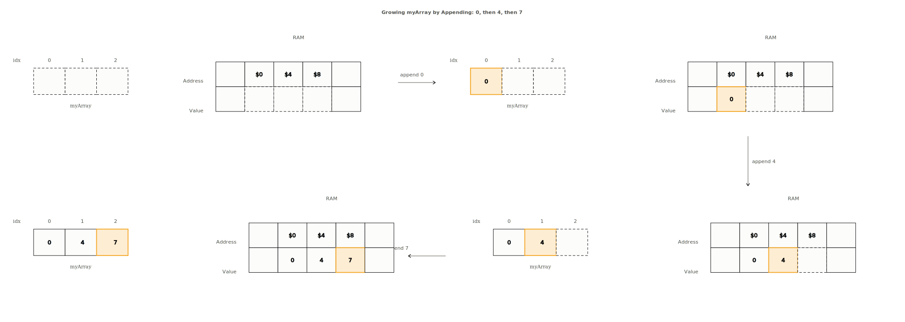
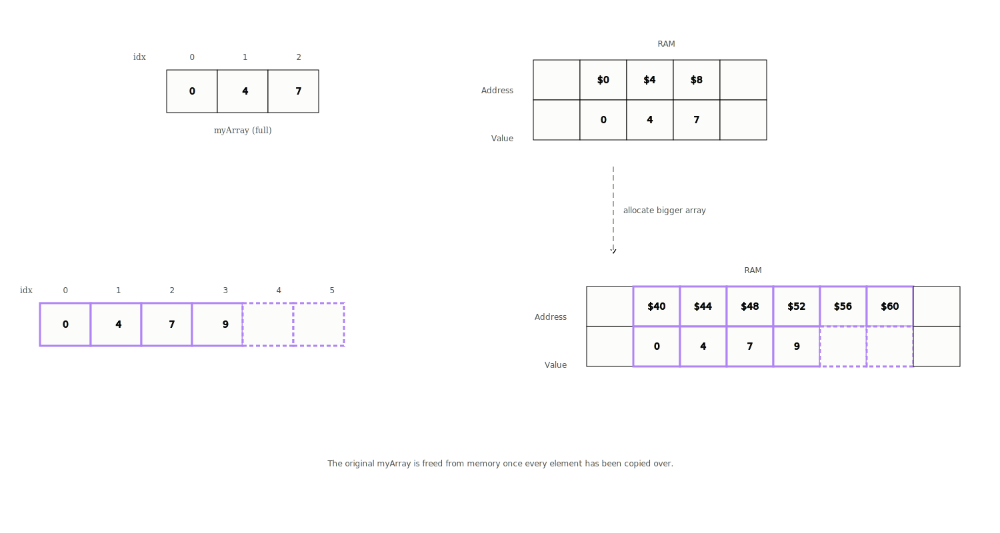
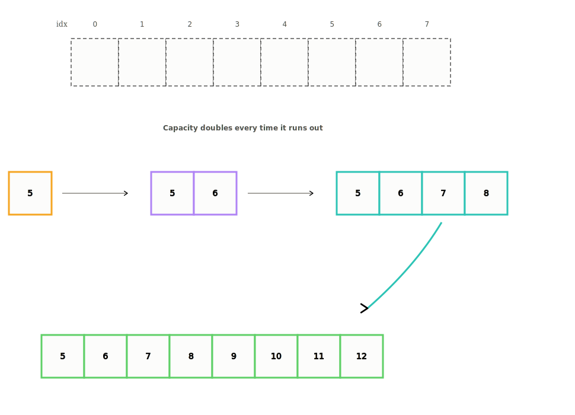

# Dynamic Arrays

**Category:** Basics &nbsp;|&nbsp; **Difficulty:** <span style="color: #334155; font-weight: 600;">Basic</span> &nbsp;|&nbsp; **Importance:** <span style="color: #ef4444; font-weight: 600;">High</span>

---

Dynamic arrays are a much more common alternative to static arrays. They are useful because they can grow as elements are added. In JavaScript and Python, these are the default arrays.

Unlike static arrays, with dynamic arrays we don’t have to specify a size upon initialization. In different languages, dynamic arrays may be assigned a default size — Java being `10` and C# being `4`. Regardless, these are automatically resized at runtime as the array grows.

## Insertion at the End

When inserting at the end of a dynamic array, the next empty space is found and the element is inserted there. Consider an array of size `3` where we push elements into it until we run out of space.

```python
# Insert n in the last position of the array
def pushback(self, n):
    if self.length == self.capacity:
        self.resize()

    # insert at next empty position
    self.arr[self.length] = n
    self.length += 1
```



## Resize

Since the array is dynamic in size, we can continue to add elements. This is achieved by copying over the values to a new static array that is double the size of the original. The resulting array will have new space allocated for it in memory.

```python
def resize(self):
    # Create new array of double capacity
    self.capacity = 2 * self.capacity
    newArr = [0] * self.capacity

    # Copy elements to newArr
    for i in range(self.length):
        newArr[i] = self.arr[i]
    self.arr = newArr
```



When all elements from the first array have been copied over, the original static array is deallocated.

Adding elements to a dynamic array runs in \(O(1)\) **amortized** time. Amortized time complexity is the average time taken per operation over a sequence of operations. The resize operation itself is \(O(n)\), but since it is not performed on every insertion, the average time per operation is \(O(1)\) — but only if we double the capacity on each resize.

## Why Double the Capacity?

Imagine filling up an array of size `8` starting from a size `1` array. The capacity would grow as: `1 → 2 → 4 → 8`.



To analyze the time complexity we must account for the **sum of all operations** that occurred before the last one. To achieve an array of size `8`:

$$1 + 2 + 4 + 8 = 15 \text{ operations}$$

The pattern is that the last (dominating) term is always greater than or equal to the sum of all terms before it:

$$1 + 2 + 4 = 7 < 8$$

Generally, for any array of size \(n\), it takes at most \(2n\) operations to create it, which belongs to \(O(n)\). Since inserting \(n\) elements is \(O(n)\), the amortized cost of a single insertion is \(O(1)\).

> With time complexity analysis we are concerned with asymptotic analysis — how quickly runtime grows as input size grows. We don’t distinguish between \(O(2n)\) and \(O(n)\) because both grow linearly. Constant terms and coefficients are dropped.

## Other Operations

Inserting or removing from the **middle** of a dynamic array works the same as a static array — elements must be shifted right or left to make space or fill the gap. This runs in \(O(n)\) time.

```python
a = []
a.append(7)      # amortized O(1)
a.pop()          # O(1)
a[i]             # O(1)
a.insert(1, 10)  # O(n) — shifts elements
a.pop(1)         # O(n) — shifts elements
```

## Time & Space Complexity

| Operation | Big-O Time | Notes |
|---|---|---|
| Access | \(O(1)\) | |
| Insertion at end | \(O(1)\)\* | Amortized; occasional resize is \(O(n)\) |
| Insertion in middle | \(O(n)\) | Shifting required |
| Deletion at end | \(O(1)\) | |
| Deletion in middle | \(O(n)\) | Shifting required |

## Useful Patterns

Arrays are often combined with:

- Frequency counting
- Prefix sums
- Two pointers
- Sliding window
- Kadane’s algorithm

---

## Additional Resources
### Recommended Python Resources
*Python lists function as dynamic arrays. For fixed-size static arrays, pre-allocate list memory.*
  - [Python Lists & Dynamic Arrays | Real Python](https://realpython.com/python-lists-tuples/)
  - [Pre-allocating lists in Python for efficiency](https://stackoverflow.com/questions/10324831/how-to-preallocate-lists-in-python)

---

## Practice Problems
| ID | Problem | Platform | Difficulty |
|---|---|---|---|
| gym_287309e | [Max](https://codeforces.com/group/MWSDmqGsZm/contest/219432/problem/E) | Codeforces | <span style="color: #2563eb; font-weight: 600;">Easy</span> |
| gym_287309y | [Easy Fibonacci](https://codeforces.com/group/MWSDmqGsZm/contest/219432/problem/Y) | Codeforces | <span style="color: #2563eb; font-weight: 600;">Easy</span> |
| gym_287310a | [Summation](https://codeforces.com/group/MWSDmqGsZm/contest/219774/problem/A) | Codeforces | <span style="color: #2563eb; font-weight: 600;">Easy</span> |
| gym_287310b | [Searching](https://codeforces.com/group/MWSDmqGsZm/contest/219774/problem/B) | Codeforces | <span style="color: #2563eb; font-weight: 600;">Easy</span> |
| gym_287310c | [Replacement](https://codeforces.com/group/MWSDmqGsZm/contest/219774/problem/C) | Codeforces | <span style="color: #2563eb; font-weight: 600;">Easy</span> |
| gym_287310e | [Lowest Number](https://codeforces.com/group/MWSDmqGsZm/contest/219774/problem/E) | Codeforces | <span style="color: #2563eb; font-weight: 600;">Easy</span> |
| gym_287310f | [Reversing](https://codeforces.com/group/MWSDmqGsZm/contest/219774/problem/F) | Codeforces | <span style="color: #d97706; font-weight: 600;">Medium</span> |
| gym_287310g | [Palindrome Array](https://codeforces.com/group/MWSDmqGsZm/contest/219774/problem/G) | Codeforces | <span style="color: #d97706; font-weight: 600;">Medium</span> |
| gym_287310h | [Sorting](https://codeforces.com/group/MWSDmqGsZm/contest/219774/problem/H) | Codeforces | <span style="color: #d97706; font-weight: 600;">Medium</span> |
| gym_287310i | [Smallest Pair](https://codeforces.com/group/MWSDmqGsZm/contest/219774/problem/I) | Codeforces | <span style="color: #d97706; font-weight: 600;">Medium</span> |
| gym_287310l | [Max Subarray](https://codeforces.com/group/MWSDmqGsZm/contest/219774/problem/L) | Codeforces | <span style="color: #d97706; font-weight: 600;">Medium</span> |
| gym_287310m | [Replace MinMax](https://codeforces.com/group/MWSDmqGsZm/contest/219774/problem/M) | Codeforces | <span style="color: #d97706; font-weight: 600;">Medium</span> |
| gym_287310p | [Minimize Number](https://codeforces.com/group/MWSDmqGsZm/contest/219774/problem/P) | Codeforces | <span style="color: #d97706; font-weight: 600;">Medium</span> |
| gym_287310q | [Count Subarrays](https://codeforces.com/group/MWSDmqGsZm/contest/219774/problem/Q) | Codeforces | <span style="color: #d97706; font-weight: 600;">Medium</span> |
| gym_287310r | [Permutation with arrays](https://codeforces.com/group/MWSDmqGsZm/contest/219774/problem/R) | Codeforces | <span style="color: #d97706; font-weight: 600;">Medium</span> |
| gym_287310s | [Search In Matrix](https://codeforces.com/group/MWSDmqGsZm/contest/219774/problem/S) | Codeforces | <span style="color: #ef4444; font-weight: 600;">Hard</span> |
| gym_287310t | [Matrix](https://codeforces.com/group/MWSDmqGsZm/contest/219774/problem/T) | Codeforces | <span style="color: #ef4444; font-weight: 600;">Hard</span> |
| gym_287310u | [Is B a subsequence of A ?](https://codeforces.com/group/MWSDmqGsZm/contest/219774/problem/U) | Codeforces | <span style="color: #ef4444; font-weight: 600;">Hard</span> |
| gym_287310v | [Frequency Array](https://codeforces.com/group/MWSDmqGsZm/contest/219774/problem/V) | Codeforces | <span style="color: #ef4444; font-weight: 600;">Hard</span> |
| gym_287310w | [Mirror Array](https://codeforces.com/group/MWSDmqGsZm/contest/219774/problem/W) | Codeforces | <span style="color: #ef4444; font-weight: 600;">Hard</span> |
| hackerrank_2d_array | [2D Array - DS](https://vjudge.net/problem/HackerRank-2d-array) | VJudge | <span style="color: #ef4444; font-weight: 600;">Hard</span> |


---

[Return to Home](../../../index.md)
