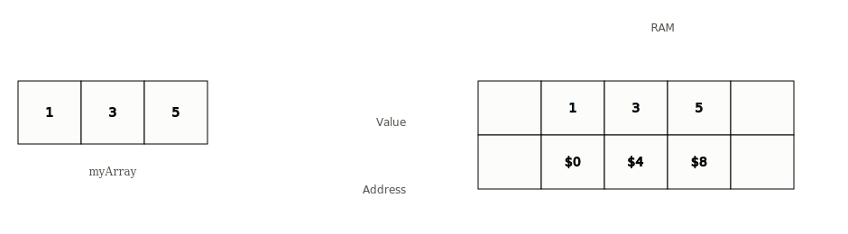
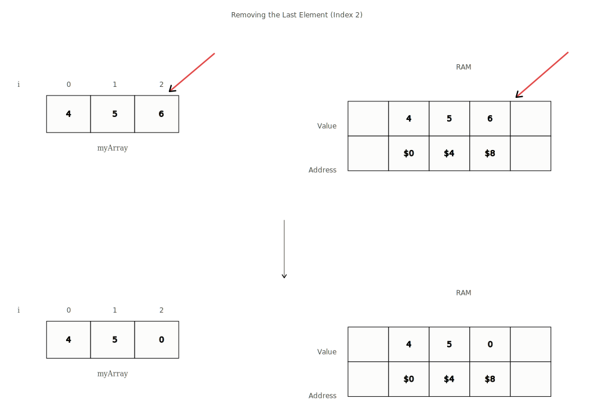
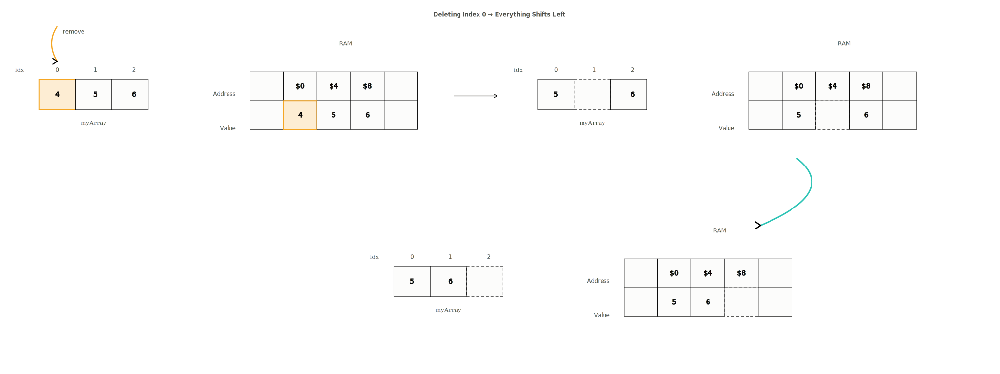
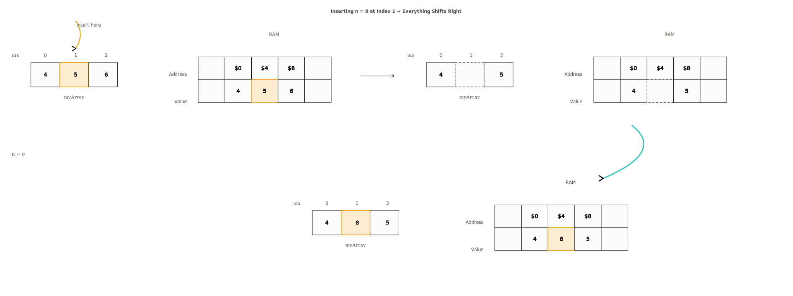

# Static Arrays

**Category:** Basics  
**Difficulty:** <span style="color: #059669; font-weight: 600;">● Very Easy</span>

---

In statically typed languages like Java, C++ and C#, arrays have to have an allocated *size and type* when initialized. These are known as static arrays.

They are called static because the size of the array cannot change once declared. And once the array is full, it cannot store additional elements. Some dynamically typed languages such as Python and JavaScript do not have static arrays to begin with — they have an alternative, which we discuss in the next lesson.

## Reading from an Array

To read an individual element from an array we can choose the position we want to access via an index. Below we have initialized an array of size `3` called `myArray`. We also attempt to access an arbitrary element using the index `i`.

```python
# initialize myArray
myArray = [1, 3, 5]

# access an arbitrary element, where i is the index of the desired value
myArray[i]
```



Accessing a single element in an array is always instant because each index of `myArray` is mapped to an address in RAM. Regardless of the size of the input array, the time taken to access a single element is the same — we refer to this as `O(1)` in terms of time complexity.

> There is a common confusion that O(1) is always fast. This is not the case. There could be 1,000 operations and the time complexity could still be O(1). If the number of operations does not grow as the size of the input grows, then it is O(1).

## Traversing Through an Array

We can also read all values within an array by traversing through it. Below are examples of how we could traverse `myArray` from start to end.

```python
for i in range(len(myArray)):
    print(myArray[i])

# OR

i = 0
while i < len(myArray):
    print(myArray[i])
    i += 1
```

The last element in an array is always at index `n - 1` where `n` is the size of the array. If the size is `3`, the last accessible index is `2`.

To traverse through an array of size \(n\) the time complexity is \(O(n)\). This means the number of operations grows linearly with the size of the array.

## Deleting from an Array

In statically typed languages, all array indices are filled with `0`s or some default value upon initialization, denoting an empty array.

When we want to remove an element from the last index, setting its value to `0` / `null` or `-1` is the best we can do. This is known as a **soft delete** — the element is not truly deleted but overwritten by a value that denotes an empty index. We also reduce the length by `1`.

```python
# Remove from the last position in the array if the array
# is not empty (i.e. length is non-zero).
def removeEnd(arr, length):
    if length > 0:
        # Overwrite last element with some default value.
        # We would also consider the length to be decreased by 1.
        arr[length - 1] = 0
```



### Deleting at an Arbitrary Index

If we wanted to delete an element at a random index `i`, naively replacing it with `0` would break the contiguous nature of the array. A better approach:

1. We are given the deletion index `i`.
2. We iterate starting from `i + 1` until the end of the array.
3. We shift each element `1` position to the left.
4. *(Optional)* Replace the last element with `0` or `null` to mark it empty, and decrement the length by `1`.

```python
# Remove value at index i before shifting elements to the left.
# Assuming i is a valid index.
def removeMiddle(arr, i, length):
    # Shift starting from i + 1 to end.
    for index in range(i + 1, length):
        arr[index - 1] = arr[index]
    # No need to 'remove' arr[i], since we already shifted
```



The worst case is shifting all elements to the left, which occurs when the target is the first index. Therefore, the above is \(O(n)\).

## Inserting at an Arbitrary Index

Inserting at an arbitrary index `i` is more involved since we may insert in the middle of the array.

Consider `[4, 5, 6]`. If we insert at index `i = 1`, we cannot overwrite the original value because we would lose it. Instead, we shift all values starting at index `i` one position to the right, then insert.

```python
# Insert n into index i after shifting elements to the right.
# Assuming i is a valid index and arr is not full.
def insertMiddle(arr, i, n, length):
    # Shift starting from the end to i.
    for index in range(length - 1, i - 1, -1):
        arr[index + 1] = arr[index]

    # Insert at i
    arr[i] = n
```



> The visual above demonstrates that shifting occurs prior to insertion to ensure values are not overwritten.

## Time & Space Complexity

| Operation | Big-O Time | Notes |
|---|---|---|
| Reading | \(O(1)\) | |
| Insertion | \(O(n)\) | \(O(1)\) if inserting at the end |
| Deletion | \(O(n)\) | \(O(1)\) if deleting at the end |

## Closing Notes

The operations discussed above are critical for solving many problems. In fact, the key to solving many problems is being able to implement insert middle and delete middle efficiently. Don't worry if the practice problems feel challenging at first — focus on understanding the concepts, and the solution will follow.

## Practice

| # | Problem | Platform | Difficulty |
|---|---|---|---|
| 1 | [Watermelon](https://codeforces.com/problemset/problem/4/A) | Codeforces | <span style="color: #059669; font-weight: 600;">● Very Easy</span> |
| 2 | [Way Too Long Words](https://codeforces.com/problemset/problem/71/A) | Codeforces | <span style="color: #059669; font-weight: 600;">● Very Easy</span> |
| 3 | [Team](https://codeforces.com/problemset/problem/231/A) | Codeforces | <span style="color: #059669; font-weight: 600;">● Very Easy</span> |
| 4 | [Missing Number](https://cses.fi/problemset/task/1083) | CSES | <span style="color: #059669; font-weight: 600;">● Very Easy</span> |
| 5 | [Increasing Array](https://cses.fi/problemset/task/1094) | CSES | <span style="color: #059669; font-weight: 600;">● Very Easy</span> |
| 6 | [Helpful Maths](https://codeforces.com/problemset/problem/339/A) | Codeforces | <span style="color: #059669; font-weight: 600;">● Very Easy</span> |
| 7 | [Permutations](https://cses.fi/problemset/task/1070) | CSES | <span style="color: #2563eb; font-weight: 600;">● Easy</span> |
