# Sliding Window (Fixed)

**Category:** Basics &nbsp;|&nbsp; **Difficulty:** <span style="color: #334155; font-weight: 600;">Basic</span> &nbsp;|&nbsp; **Importance:** <span style="color: #ef4444; font-weight: 600;">High</span>

---

The idea behind having a fixed sliding window is to maintain two pointers that are $k$ apart from each other and fit a certain constraint.

## Motivation

> **Q: Given an array, return true if there are two elements within a window of size $k$ that are equal.**

The brute force way of approaching this problem is to consider every subarray of size $k$ and check if there are any duplicates.

Let's say that we have the array `[1, 2, 3, 2, 3, 3]`, with `k = 3`.

Using the brute-force approach, our outer loop will loop $n$ times and our inner loop will repeat $k$ times, where $k \le n$ meaning that in the worst case, we end up with quadratic time complexity, $O(n^2)$ or $O(n * k)$ if we want to be more precise.

```python
def closeDuplicatesBruteForce(nums, k):
    for L in range(len(nums)):
        for R in range(L + 1, min(len(nums), L + k)):
            if nums[L] == nums[R]:
                return True
    return False
```

## Sliding Window Approach

We can do better with the sliding window. The idea is the same as what we discussed in the previous chapter when we introduced the sliding window variation of Kadane's algorithm. In this case, we must maintain a window of size $k$ and within our window:

Hash sets allow us to store unique elements and have an $O(1)$ lookup, removal, and add complexity. If we needed more than just two occurrences, we could use a hash map to store the count of each element, but in this case a set is sufficient.

We can use a set to store elements currently in our window. When our set's size goes beyond $k$, we can remove elements, shift the left pointer, and remove the element that is no longer in our window.

Since we are adding from the right, if we encounter a number that has already been added, we can return true. Our set's size should never exceed $k$.

```python
def closeDuplicates(nums, k):
    window = set() # Cur window of size <= k
    L = 0
    
    for R in range(len(nums)):
        if R - L + 1 > k:
            window.remove(nums[L])
            L += 1
        if nums[R] in window:
            return True
        window.add(nums[R])
        
    return False
```



> \* *The elements in red represent the current window*

## Time & Space Complexity

### Time
We bring the time complexity down from $O(n^2)$ to $O(n)$ because we only perform a single pass on the array and our hashset allows us to have $O(1)$ lookup.

### Space
The space complexity is $O(k)$ because we are storing at most $k$ distinct elements in our hashset.

---

## Additional Resources
### Recommended Python Resources
*The concept and algorithmic implementation remain identical in Python. Refer to the general resources above.*
  - [Python implementation guide for Sliding Window Technique](https://www.geeksforgeeks.org/sliding-window-technique-in-python/)

---

## Practice Problems
| ID | Problem | Platform | Difficulty |
|---|---|---|---|
| atcoder_abc194_e | [Mex Min](https://atcoder.jp/contests/abc194/tasks/abc194_e) | AtCoder | <span style="color: #d97706; font-weight: 600;">Medium</span> |
| codechef_p6172 | [Tactical Removal](https://www.codechef.com/problems/P6172) | CodeChef | <span style="color: #ef4444; font-weight: 600;">Hard</span> |
| codeforces_1692g | [2^Sort](https://codeforces.com/problemset/problem/1692/G) | Codeforces | <span style="color: #2563eb; font-weight: 600;">Easy</span> |
| cses_1076 | [Sliding Window Median](https://cses.fi/problemset/task/1076) | CSES | <span style="color: #d97706; font-weight: 600;">Medium</span> |
| cses_3221 | [Sliding Window Minimum](https://cses.fi/boi24/task/3221) | CSES | <span style="color: #2563eb; font-weight: 600;">Easy</span> |
| hackerrank_deque_stl | [Deque-STL](https://vjudge.net/problem/HackerRank-deque-stl) | VJudge | <span style="color: #ef4444; font-weight: 600;">Hard</span> |


---

[Return to Home](../../../index.md)
