# Sliding Window (Variable Size)

**Category:** Basics &nbsp;|&nbsp; **Difficulty:** <span style="color: #334155; font-weight: 600;">Basic</span> &nbsp;|&nbsp; **Importance:** <span style="color: #ef4444; font-weight: 600;">High</span>

---

Another variation of the sliding window technique is the variable size sliding window. This is useful when we don't have a fixed window size and we need to keep expanding our window as long as our window meets a certain constraint.

## Simple Example

> **Q: Find the length of the longest subarray with the same value in each position.**

Let's apply the sliding window technique to the input array `[4, 2, 2, 3, 3, 3]`.

Again, we can make use of two pointers, `L` and `R`. Our constraint is that we cannot have multiple distinct values in our window. We need to find the longest subarray so we should try to maximize our window while it is valid.

1. We can start at the beginning and keep expanding our window from the right.
2. Once we encounter a new value, we stop expanding our window.
3. We then shrink our window by bringing our `L` pointer to our `R` pointer. We don't need to increment `L` because if we encountered a new value, it must be the case that every value before was a duplicate.
4. We then repeatedly calculate the `length` of our window by taking the maximum of the current length and the maximum length.
5. The length can be calculated by taking the difference between `R` and `L` and adding 1.

```python
def longestSubarray(nums):
    length = 0
    L = 0
    
    for R in range(len(nums)):
        if nums[L] != nums[R]:
            L = R
        length = max(length, R - L + 1)
    return length
```



> \* *l represents the maximum length so far*

## Classic Example

> **Q: Find the minimum length subarray, where the sum is greater than or equal to the target. Assume all values are positive.**

1. First we need to ensure our window has a sum greater than or equal to the target. We do this by expanding our window from the right.
2. Next we need to minimize the size of our window. We do this by shrinking our window from the left.

```python
def shortestSubarray(nums, target):
    L, total = 0, 0
    length = float("inf")
    
    for R in range(len(nums)):
        total += nums[R]
        while total >= target:
            length = min(R - L + 1, length)
            total -= nums[L]
            L += 1
            
    return 0 if length == float("inf") else length
```



## Time & Space Complexity

### Time Complexity
Even though we have nested loops, the time complexity of this approach is $O(n)$.

The inner loop won't necessarily run $n$ times at every iteration. In fact, it may not run at all in some iterations. This is what is referred to as amortized analysis. The total number of iterations of the inner loop is $n$, same as the outer loop.

Thus, both pointers move at most $n$ times, making the time complexity $O(n)$.

### Space Complexity
The space complexity is $O(1)$ because we only need a few variables to store the pointers and the current running sum/length.

---

## Additional Resources
- [YouKn0wWho Academy - Sliding Window Technique](https://youkn0wwho.academy/topic-list/sliding-window-technique)
  - [Python implementation guide for Sliding Window Technique](https://www.geeksforgeeks.org/sliding-window-technique-in-python/)

---

## Practice Problems
| ID | Problem | Platform | Difficulty |
|---|---|---|---|
| atcoder_abc194_e | [Mex Min](https://atcoder.jp/contests/abc194/tasks/abc194_e) | AtCoder | <span style="color: #d97706; font-weight: 600;">Medium</span> |
| codechef_p6172 | [Tactical Removal](https://www.codechef.com/problems/P6172) | CodeChef | <span style="color: #ef4444; font-weight: 600;">Hard</span> |
| codeforces_1692g | [2^Sort](https://codeforces.com/problemset/problem/1692/G) | Codeforces | <span style="color: #2563eb; font-weight: 600;">Easy</span> |
| cses_1076 | [Sliding Window Median](https://cses.fi/problemset/task/1076) | CSES | <span style="color: #d97706; font-weight: 600;">Medium</span> |
| cses_3221 | [Sliding Window Minimum](https://cses.fi/boi24/task/3221) | CSES | <span style="color: #2563eb; font-weight: 600;">Easy</span> |
| hackerrank_deque_stl | [Deque-STL](https://vjudge.net/problem/HackerRank-deque-stl) | VJudge | <span style="color: #ef4444; font-weight: 600;">Hard</span> |


---

[Return to Home](../../../index.md)
