# Two Pointers

**Category:** Basics &nbsp;|&nbsp; **Difficulty:** <span style="color: #334155; font-weight: 600;">Basic</span> &nbsp;|&nbsp; **Importance:** <span style="color: #ef4444; font-weight: 600;">High</span>

---

We have already seen a variation of the two pointers technique when we learned about the sliding window, which also involves two pointers.

The main idea is to have a `L` (left) pointer and a `R` (right) pointer, both starting at some indices of the array. They don't always have to start at the beginning of the array, as is common in the sliding window technique. The `L` and `R` pointers can start at any index of the array.

## Concept

We will start the `L` pointer at `0` and `R` pointer at `arr.length - 1` and increment either the `L`, or decrement `R`, or both depending on the conditions given in the problem. This repeats until the pointers meet each other.

## Palindrome Example

> **Q: Check if an array is palindrome.**

A palindrome is a sequence that reads the same backwards as forwards. We can employ our two pointer implementation mentioned above.

If we have a string `word` and start our left pointer at the index `0` and our right pointer at index `word.length - 1`, every character at every `L` must match with every character at `R`.

```python
def isPalindrome(word):
    L, R = 0, len(word) - 1
    while L < R:
        if word[L] != word[R]:
            return False
        L += 1
        R -= 1
    return True
```

The time complexity of this technique is $O(n)$ where $n$ is the length of the input array. This is because we only visit each character once.

## Target Sum Example

> **Q: Given a sorted input array, return the two indices of two elements which sums up to the target value. Assume there's exactly one solution.**

The trivial approach here would be to iterate over every single pair of integers. However, this is a $O(n^2)$ time solution. With the two pointers technique, we can reduce this to $O(n)$ time.

Since this is a sorted array, we can utilize this information to move our pointers intelligently. Just like before, we can start our `L` and `R` pointers at `0` and `arr.length - 1`, respectively.

We can calculate the sum at every single position of both of our pointers. If the sum is too large, we can decrement our `R` pointer and if the sum is too small, we can increment our `L` pointer.

> [!NOTE]
> The reason we decrement `R` to make the sum smaller is because every number to the left of `arr[R]` is smaller than `arr[R]`. By the same token, every number to the right of `arr[L]` is greater than `arr[L]`. You may not be 100% sure this will always work, but the reason it does relies on a math technique known as **proof by contradiction**.

```python
def targetSum(nums, target):
    L, R = 0, len(nums) - 1
    while L < R:
        if nums[L] + nums[R] > target:
            R -= 1
        elif nums[L] + nums[R] < target:
            L += 1
        else:
            return [L, R]
```



## Time & Space Complexity

### Time Complexity
In both cases the time complexity is $O(n)$ where $n$ is the length of the input array. This is because we only visit each element once.

### Space Complexity
The space complexity is $O(1)$ because we only need a few variables to store the pointers.

---

## Additional Resources
- [YouKn0wWho Academy - Two Pointers](https://youkn0wwho.academy/topic-list/two-pointers)

---

## Practice Problems
This topic contains no problems.

---

[Return to Home](../../../index.md)
