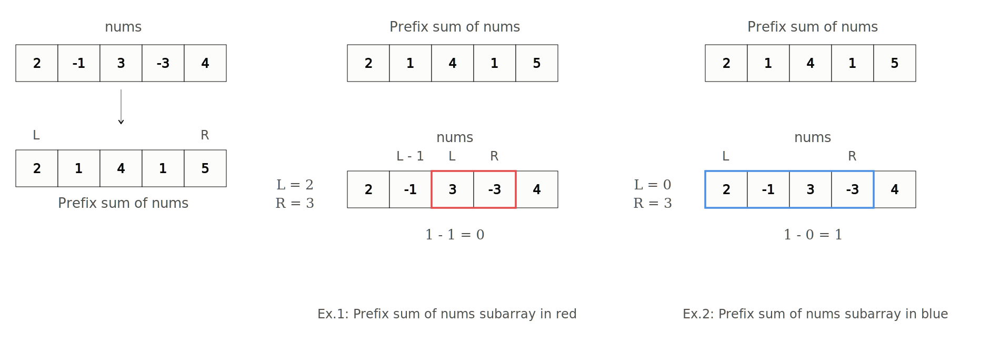

# Prefix Sums

**Category:** Basics  
**Difficulty:** <span style="color: #2563eb; font-weight: 600;">● Easy</span>

---

A prefix sum is a super useful technique that can be used with arrays. Suppose we have an array `nums = [2, -1, 3, -3, 4]`. The basic idea here is that we create an array, say, `prefix`, and fill it up such that the value at its $i$-th index denotes the running sum of a `nums` subarray that starts from $0$ and goes up to and including the $i$-th index. This is extremely useful when we want to retrieve the sum of a subarray ending at an arbitrary index, say $i$.

So, given an array `[2, -1, 3, -3, 4]`, the prefix sum array would be `[2, 1, 4, 1, 5]`.

## Range Sum Query Example

> **Q: Given an array of values, design a data structure that can query the sum of a subarray of the values.**

First, let's build our prefix sum. We can do this in a class called `PrefixSum`, which will take the array `nums` that we want to build a prefix sum for. We can then add each of the numbers in `nums` to a variable called `total` and append the `total` to our `prefix` array at each iteration.



```python
class PrefixSum:

    def __init__(self, nums):
        self.prefix = []
        total = 0
        for n in nums:
            total += n
            self.prefix.append(total)
```

After building this sum, we can calculate the sum of any subarray that starts at `left` and ends at `right` in $O(1)$ time.

We can do this by `prefix[right] - prefix[left - 1]`. The `- 1` will ensure we exclude the running sum of all the numbers before `left`. However, if `left` points to `0`, to avoid an index out of bounds error, we can use a ternary operator to check if `left` is `0` in which case we will return `0` as a substitute for `prefix[left - 1]`.

```python
    def rangeSum(self, left, right):
        preRight = self.prefix[right]
        preLeft = self.prefix[left - 1] if left > 0 else 0
        return preRight - preLeft
```

Let's visualize how prefix sum is calculated in $O(1)$ time where `L = 2` and `R = 3` and the case where `L = 0` and `R = 3` (where no prefix exists for the first element).



## Time & Space Complexity

### Time Complexity
The time complexity to build the initial prefix sum is $O(n)$. However, to calculate a range sum, we will only perform $O(1)$ operations no matter how large the array is.

### Space Complexity
The space complexity to store the prefix sum array is $O(n)$. If we don't need the initial array, we can actually overwrite it with its prefix sum, which will bring the space complexity down from $O(n)$ to $O(1)$. This works because the size of an array's prefix sums will be the same as the size of the array.

## Closing Notes

It should also be noted that sum is not the only operation we can perform using this technique. We can also calculate a prefix product and other prefix operations.

We can also do the opposite and get a **postfix sum**, which would be a running sum of all the elements starting from the end of the array and going backwards.

---

## YouKn0wWho Academy Reference
While we prepare our written explanations for this topic, you can follow the interactive path and submit solutions directly on the YouKn0wWho Academy platform:

👉 [YouKn0wWho Academy Topic Syllabus](https://youkn0wwho.academy/topic-list)

---

## Additional Resources
### 📘 General & C++ Resources
- [Prefix Sums - Problems | Errichto Algorithms](https://www.youtube.com/watch?v=PhgtNY_-CiY) ⭐ 🎥
  - [Introduction to Prefix Sums | USACO Guide](https://usaco.guide/silver/prefix-sums?lang=cpp) ⭐


---

## Topic Details
- **Difficulty**: Basic
- **Importance**: High
- **Phase**: Phase 1
- **Interview Topic**: Yes

---

## Curated Practice Problems
*No practice problems mapped to this topic. Check back soon!*

---

[Return to Home](../../../index.md)
