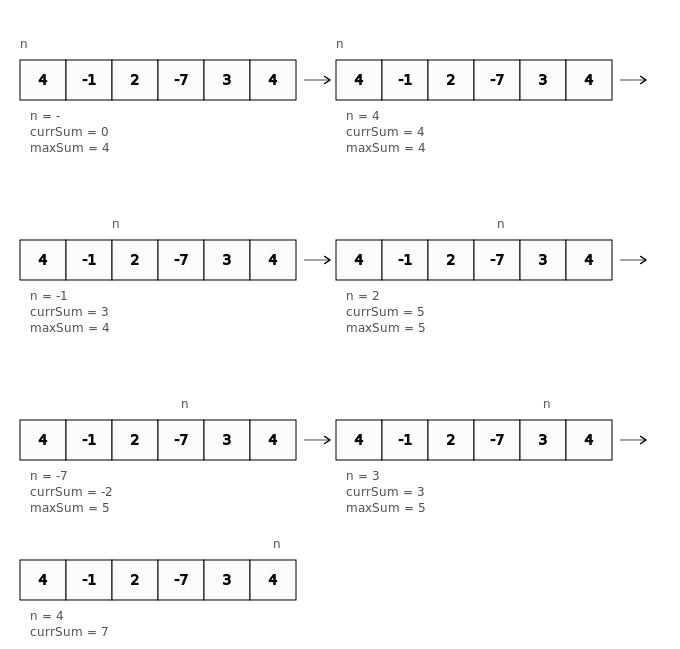

# Kadane's Algorithm

**Category:** Basics  
**Difficulty:** 🟡 Easy

---

Kadane's algorithm is a greedy/dynamic programming algorithm that can be used on an array. It is used to calculate the maximum sum subarray ending at a particular position and typically runs in `O(n)` time.

## Motivation

**Q: Find a non-empty subarray with the largest sum.**

We need to find a group of contiguous elements in an array that result in the maximal sum.

The brute force way to approach this would be to go through every single subarray and calculate the sum, while keeping track of the maximum sum.

For every iteration of our outer for loop, our inner loop does linear work. This makes the complexity `O(n²)`.

```python
def bruteForce(nums):
    maxSum = nums[0]
    for i in range(len(nums)):
        curSum = 0
        for j in range(i, len(nums)):
            curSum += nums[j]
            maxSum = max(maxSum, curSum)
    return maxSum
```

While this approach works, it is not the most efficient. The intuition behind Kadane's algorithm is that:

1. If all elements in the array are positive, the maximum sum subarray is the entire array.
2. If we ever have a negative sum subarray, that’s the case we want to avoid.

## Optimizing with Kadane's Algorithm

Kadane's algorithm tells us that there is a way to calculate the largest sum by only making one pass on the array, bringing the complexity down to linear time.

Since we are looking for the largest sum, it is a good idea to avoid negative numbers because we know that contradicts what the question is asking for. Negative numbers will only make our sum smaller.

But sometimes we may need to include a negative number to get the surrounding positive numbers.

- The array `[4, -1, 7]` has a maximum sum of `10`. If we exclude the `-1`, we can’t include both `4` and `7`.
- If we have `[1, -3, 7]`, the maximum sum is `7`. Including the `-3` isn’t worth it just to get the `1`.

The pattern is that if we ever have a negative subarray sum, we should discard it and start a new subarray. This is because the sum will only get smaller if we include it.

**Algorithm steps:**

1. Kadane’s algorithm runs one loop.
2. We keep track of `curSum` by adding the current element to it.
3. Before adding the current element, we check if `curSum` is negative. If it is, we reset it to zero.
4. We initialize `maxSum` to the first element in the array — technically a subarray of size 1.
5. We update `maxSum` by taking the maximum of the current sum and the maximum sum so far.

It’s possible that every element in the array is negative. In that case, the maximum sum would be the largest negative number.



```python
def kadanes(nums):
    maxSum = nums[0]
    curSum = 0
    for n in nums:
        curSum = max(curSum, 0)
        curSum += n
        maxSum = max(maxSum, curSum)
    return maxSum
```

## Sliding Window

Sometimes, a problem may ask to return the actual subarray containing the largest sum, instead of just the sum itself. We can do this by keeping track of a “window” — a contiguous subarray that does not break our constraint of the sum staying positive.

To do this, we use:

- A left pointer `L = 0` and a right pointer `R` to define the current window boundaries (inclusive).
- Two extra pointers `maxL` and `maxR` to track the subarray with the maximum sum found so far.

Similar to before, if our current sum becomes negative, we move `L` all the way to `R` — discarding all elements and starting a new window.

```python
def slidingWindow(nums):
    maxSum = nums[0]
    curSum = 0
    maxL, maxR = 0, 0
    L = 0
    for R in range(len(nums)):
        if curSum < 0:
            curSum = 0
            L = R
        curSum += nums[R]
        if curSum > maxSum:
            maxSum = curSum
            maxL, maxR = L, R
    return [maxL, maxR]
```



> \* *The elements in red represent the current window*

## Time & Space Complexity

| Metric | Complexity | Reason |
|---|---|---|
| Time | `O(n)` | Single pass through the array |
| Space | `O(1)` | Only a few variables needed |

## Closing Notes

Next, we’ll formally look at the sliding window technique. There are two variations — fixed sliding window and variable sized sliding window — both of which are useful for different kinds of problems.

## Practice

| # | Problem | Platform | Difficulty |
|---|---|---|---|
| 1 | [Maximum Subarray Sum](https://cses.fi/problemset/task/1643) | CSES | 🟡 Easy |
| 2 | [Maximum Subarray Sum II](https://cses.fi/problemset/task/1644) | CSES | 🟠 Medium |
| 3 | [Lamps](https://codeforces.com/problemset/problem/363/B) | Codeforces | 🟡 Easy |

## Source notes

- [Kadane’s Algorithm Notes](https://drive.google.com/open?id=1x_W1epn7zn5XrAVJlgyh-1k2IvYaCP5ILcVTpFECeUY)
